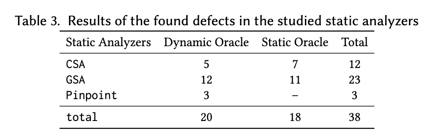

# Finding and Understanding Defects in Static Analyzers
## 1. Abstract
Static analyzers are playing crucial roles in finding program bugs or vulnerabilities, and thus improving software reliability. However, these analyzers often report with both false positives (FPs) and false negatives (FNs) resulting from implementation flaws and design choices, which obstruct their practical applicability. Detecting the defects of analyzers remains challenging since static analyzers usually lack clear specifications,
and the results obtained from different static analyzers may differ.To overcome this challenge, this paper designs two types of oracles to find defects in static analyzers with randomly generated programs. The first oracle is derived from dynamic execution results and the second one leverages the program states reasoned by the static analyzers. To evaluate the effectiveness of these two oracles, we built a testing framework to perform a testing campaign on three state-of-the-art static analyzers: Clang Static Analyzer (CSA), GCC Static Analyzer (GSA), and Pinpoint. We found 38 unique defects in these analyzers, 28 of which have been confirmed or fixed by the developer. We conducted a comprehensive case study on the found defects followed by several insights and lessons learned for improving static analyzers.

## 2. Methodology
In this paper we propose two novel types of oracles to find defects in static analyzers. On the one hand, we observe that many static analyzers support checkers to find specific coding issues such as null pointer dereference (NPD) and out of bounds (OOB). Thus, our insight is to leverage such checkers as the handler to validate the correctness of static analyzers. Specifically, we can use the runtime properties (e.g., existence of NPD or OOB) of the given program as the ground-truth to validate the results of the corresponding checkers. We named this type of oracle as the dynamic oracle. On the other hand, we observe that many static analyzers privode debug checks to inspect the program states. Thus, our insight is to generate equivalent but different representations of program states to validate the analysis results. We named this type of oracle as the static oracle.  

<p align="center">

</p>

Specifically, in the dynamic oracle, we derive the ground truth from the dynamic running outcomes. Our insight is that if we have a program which has only a single execution path and we possess knowledge of whether a bug exists on this particular path through dynamic running, it is feasible to employ that path as an oracle for static analyzers. To identify false positives, we use Csmith, a state-of-the-art automatic program generator, to generate random and closed (i.e.,one-execution-path and no-argument) programs. We then perform dynamic execution to ensure the absence of a specific warning such as NPD. If the static analyzer reports the specific warning in the program, it is considered a false positive. To identify false negatives, we intentionally insert an NPD bug into the program under analysis and perform dynamic running once again to confirm that the error occurs. If the static analyzer fails to detect the injected bug, it is considered a false negative. We use this approach to generate the code in Listing 1, which exposes a defect in the GCC Static Analyzer (GSA). GSA reports a warning of NPD at line 8, which is a false positive and has been promptly resolved by the developers.  

<p align="center">

</p>

In the static oracle, we generate ground truths by inserting equivalent expressions or partial order mutants of an _if_ condition at the interesting points of the _if_ branch within the input program. Our insight is that the starting point of a true branch must satisfy a basic property - that is, the expression of the branch condition is true along all possible execution paths passing that point. Therefore, any negative assessments of the aforementioned inserted expressions will reveal defects of the tool. The static oracle is complementary to the dynamic oriacle. The code in Listing 2 with the static oracles shows a defect of GSA. In the true branch of _if (c == \&b[0])_, GSA should have the ability to evaluate both _(c + 1) == (\&b[0] + 1)_ and  _(c + 0) == (\&b[0] + 0)_, which are equivalent mutants of the aforementioned conditional statement, to be _TRUE_. However,  GSA evaluates _(c + 1) == (\&b[0] + 1)_ to be _FALSE_. The issue has been confirmed by the developers

<p align="center">

</p>

## 3. Results of the Found Defects
Table 3 gives the results of found defects in CSA, GSA, and Pinpoint. Specifically, the dynamic oracle found 5, 12, and 3 defects in CSA, GSA, and Pinpoint, respectively, while the static oracle found 7 and 11 defects in CSA and GSA, respectively. Overall, the dynamic and static oracle found 20 and 18 defects, respectively. The numbers of defects found in CSA, GSA, and Pinpoint are 12, 23, and 3, respectively. In total, we found 38 defects in the three static analyzers.
<p align="center">

</p>

Table 4 lists these found defects. Specifically, to facilitate understanding these found defects, we classified them into 8 major groups from low-level to high-level issues, including “Implementation Errors”, “Defects in Heuristics”, “Defects in Handling Loops”, “Mishandling Language Features”, “Overly Eager Assumption”, “Defects Induced by Design Choices”, “Defects Induced by Compiler Optimizations”, and “Others”. In Table 4, column “Class" gives classification of the defect. Column “Status" gives the status of the defect, including “fixed”, “confirmed”, “duplicated” (also reported by others), and “pending” (under active discussion between developers). Column “Oracle” indicates which type of oracle found this defect. Specifically, for the dynamic oracle type, the annotation of the “-” sign indicates that the corresponding defect is a false nagetive (FN), while the annotation of the “+” sign indicates that the corresponding defect is a false positive (FP). In total, by using the dynamic oracle, we found 7 false negatives and 13 false positives. Column “Analyzer” indicates which static analyzer is affected. Column “Defect Description” gives a brief description of the defect. Among all the 38 found defects, 28 have been confirmed by developers. Of these 28 confirmed defects, four were confirmed as duplicated (which were also reported by others) and four defects have been quickly fixed. 
<p align="center">

</p>

## 4. Replication
This replication package includes all the artifacts in this study, i.e., the found defects and the source code of testing static analyzers.

### 4.1 Contents
```text
Root Dir
    |
    |--- defects: the found defeccts
    |--- tools.py: the script scripts for running testing 
    |--- run_pinpoint.py: the script to use pinpoint to analyze Csmith-generated c program
    |--- interestness_template_pinpoint.py: the template for generate the reducing script to reducing the FP-inducing program of pinpoint
    |--- interestness_template_gcc.py:  the template for generate the reducing script to reducing the FP-inducing program of gcc
    |--- interestness_template_clang.py: the template for generate the reducing script to reducing the FP-inducing program of csa
    |--- fn_interestness_template_gsa.py:  the template for generate the reducing script to reducing the FN-inducing program of gcc
    |--- fn_interestness_template_csa.py: the template for generate the reducing script to reducing the FN-inducing program of csa
    |--- interestness_eval_template_gcc.py: the template for generate the reducing script to reducing the evaluation-error-inducing program of gcc
    |--- interestness_eval_template_clang.py: the template for generate the reducing script to reducing the evaluation-error-inducing program of csa
    |--- fuzz_sa_fp.py: the script to find fp-inducing programs in the static analyzers
    |--- fuzz_sa_fn.py: the script to find fn-inducing programs in the static analyzers
    |--- fuzz_sa_eval.py: the script to find evaluation-error-inducing programs in the static analyzers
    |--- config.py: the configrations during testing
    |--- static_muation: the instrumentation tools for creating the static oracles
       
```
### 4.2 Instructions for using this replication package
Before testing, first you need to install GCC, Clang, Pinpoint, Csmith, and Creduce.
Second, you need to download the source code of llvm-program and put the ''static _mutate'' directory in the ''clang-tools-extra'' directory of llvm-program and compile it. Then you can follow the steps below to testing static analyzers.

#### Fuzzing FP  (The dynamic oracle)

**Step 1. Fuzzing**

Fuzzing GSA with the `npd` checker, -O0 optimaztion, 1 thread, and 10 iterations at the current dir:
``` bash
python3 tools.py fuzz-fp . gcc npd 0 1 10
```
The usage of fuzz-fp is as following:
``` bash
$ python3 tools.py fuzz-fp -h
usage: tools.py fuzz-fp [-h] path {gcc,pinpoint,clang} {npd,oob} {0,1,2,3} thread num

positional arguments:
  path                  given a parent dir of fuzzing working dir
  {gcc,pinpoint,clang}  give a analyzer
  {npd,oob}             give a checker
  {0,1,2,3}             optimization level
  thread                specify the thread num for fuzzing
  num                   the iteration times of fuzzing
```

**Step 2. Checking the wrning line reachable:**

Aftering entering the fuzzing dir, typing the following command:
```bash
python3 tools.py check-reach gcc npd 0 -d=.
```
The usage of check-reach:
```bash
$ ftool check-reach -h
usage: tools.py check-reach [-h] [-s] [-mn | -ma] [-cf CFILE | -d DIR] {gcc,pinpoint,clang} {npd,oob} {0,1,2,3}

positional arguments:
  {gcc,pinpoint,clang}  give a analyzer
  {npd,oob}             give a checker
  {0,1,2,3}             optimization level

options:
  -h, --help            show this help message and exit
  -s, --saveOutput      do not delete generated files in checking process
  -mn, --rmNonReachable
                        remove non-warning-line-reachable test c files
  -ma, --rmAllReachable
                        remove all-warning-line-reachable test c files
  -cf CFILE, --cfile CFILE
                        give a cfile
  -d DIR, --dir DIR     give a directory
```

**Step 3. Generating the reducing scripts:**

Aftering entering the "reachable" dir, typing the following command:
```bash
python3 tools.py gen-reduce /path/to/interestness_template_gcc.py gcc 0 -d=.
```
The usage of gen-reduce:
```bash
$ python3 tools.py gen-reduce -h
usage: tools.py gen-reduce [-h] [-f CFILE | -d DIR] template {clang,pinpoint,gcc} {npd,oob} {0,1,2,3}

positional arguments:
  template              specify reduce template
  {clang,pinpoint,gcc}  give a analyzer
  {npd,oob}             give a checker
  {0,1,2,3}             optimization level

options:
  -h, --help            show this help message and exit
  -f CFILE, --cfile CFILE
                        specify cfile
  -d DIR, --dir DIR     give a directory
```

**Step 4. Running the reducing script :**
```bash
python3 tools.py run-reduce -d=. 10 
```
The usage of run-reduce:
```bash
$ python3 tools.py run-reduce -h
positional arguments:
  dir         give a directory
  thread      specify the thread num for reducing

options:
  -h, --help  show this help message and exit
```

#### Fuzzing eval usage (The static oracle)
**Step 1. Fuzzing**

Fuzzing GSA with -O0 optimaztion, 1 thread, and 10 iterations at the current dir:
``` bash
python3 tools.py fuzz-eval . gcc 0 1 10
```
The usage of fuzz-fp is as following:
``` bash
$ python3 tools.py fuzz-eval -h
usage: tools.py fuzz-eval [-h] path {gcc,clang} {0,1,2,3} thread num

positional arguments:
  path         given a parent dir of fuzzing working dir
  {gcc,clang}  give a analyzer
  {0,1,2,3}    optimization level
  thread       specify the thread num for fuzzing
  num          the iteration times of fuzzing

options:
  -h, --help   show this help message and exit
```
**Step 2. Generating the reducing scripts:**

Aftering entering the fuzzing dir, typing the following command:
```bash
python3 tools.py gen-reduce /path/to/interestness_eval_template_gcc.py gcc 0 -d=.
```
The usage of gen-reduce:
```bash
$ python3 tools.py gen-reduce -h
usage: tools.py gen-reduce [-h] [-f CFILE | -d DIR] template {clang,pinpoint,gcc} {npd,oob} {0,1,2,3}

positional arguments:
  template              specify reduce template
  {clang,pinpoint,gcc}  give a analyzer
  {npd,oob}             give a checker
  {0,1,2,3}             optimization level

options:
  -h, --help            show this help message and exit
  -f CFILE, --cfile CFILE
                        specify cfile
  -d DIR, --dir DIR     give a directory
```

**Step 3. Running the reducing script :**
```bash
python3 tools.py run-reduce-eval -d=. 10 gcc 0
```
The usage of run-reduce-eval:
```bash
$ python3 tools.py run-reduce-eval -h
usage: tools.py run-reduce-eval [-h] [-d DIR] [-f FILE] thread {gcc,clang} {0,1,2,3}

positional arguments:
  thread                specify the thread num for reducing
  {gcc,clang}           give a analyzer
  {0,1,2,3}             optimization level

options:
  -h, --help            show this help message and exit
  -d DIR, --dir DIR     give a directory
  -f FILE, --file FILE  give a file
```